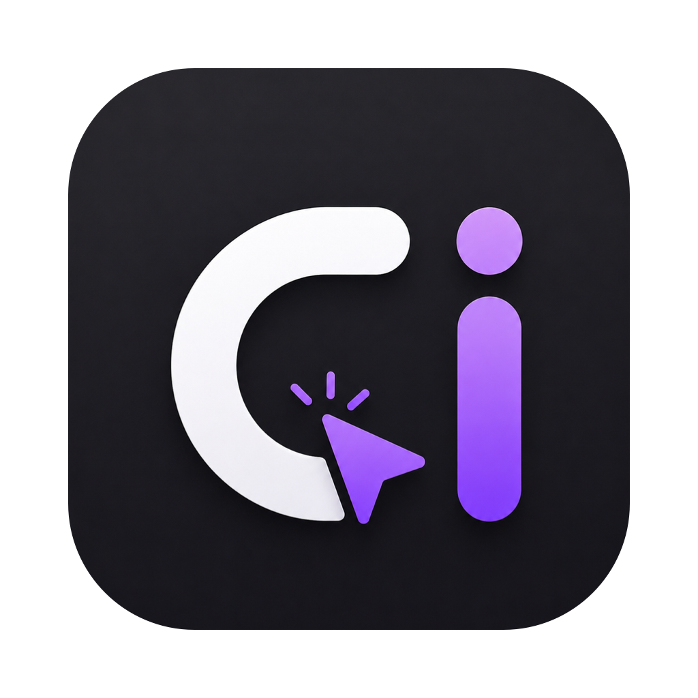
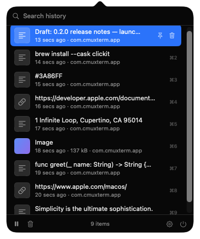

# Clickit

Clickit is a lightweight, open-source clipboard-history utility for macOS. It lives in the menu bar and lets users find and reuse recently copied text, links, images, and screenshots without sending data to the cloud.

---

## Development status

**Early development. Not production-ready.**

Clickit is at the end of roadmap **Phase 2**. The core loop works — copy, find, restore, paste — and history now survives quitting. The app is not signed, not notarized, and not distributed, so building from source is the only way to run it.

Do not rely on Clickit as your only copy of anything.

| Area | Status |
| --- | --- |
| Menu-bar app, popover UI | Working |
| Text / URL / image capture | Working |
| Duplicate detection, search, pin, delete | Working |
| Retention and cleanup rules | Working |
| Image files on disk | Working |
| History survives quitting Clickit | Working |
| History cleared on Mac restart | Working |
| Global shortcut | Not implemented — Phase 4 |
| Launch at login | Not implemented — Phase 4 |
| Excluded applications | Partial — see [Privacy](#privacy) |
| Unsigned disk image build | Working |
| Signed release, notarization, Homebrew | Not available — Phase 5 |

## Screenshot

<p align="center">
  
</p>

## Core features

- **Menu-bar only.** No Dock icon, no window clutter. Click the icon for a compact popover.
- **Additive, never disruptive.** Command-C and Command-V keep working exactly as macOS intends. Clickit only watches and restores.
- **Text, links, images and screenshots.** Content is classified automatically.
- **Search** across your history as you type.
- **Pin** items you want to keep, **delete** the ones you do not.
- **Duplicate-aware.** Copying the same thing twice moves the existing entry to the top instead of piling up.
- **Pause monitoring** at any time; the menu-bar icon shows which mode you are in.
- **Capture confirmation.** The menu-bar icon briefly shows a checkmark when something is recorded, so you know it landed.
- **Automatic cleanup** with configurable size, count and age limits.
- **Persistent across app restarts.** History is kept in a local SQLite database, so quitting Clickit or having it crash loses nothing.
- **Cleared when the Mac restarts.** History is a working set for the current session, not an archive. Pinned items are always kept. This is a setting, so you can turn it off.
- **Local only.** No network requests, no accounts, no telemetry, no AI.

## Installation

There is no signed release and Clickit is **not on Homebrew**. You can either build from source, or package an unsigned disk image yourself:

```bash
./scripts/build-dmg.sh
```

That produces `dist/Clickit-<version>.dmg` with the usual drag-to-Applications layout.

### Opening an unsigned build

The disk image is **not signed with a Developer ID and not notarized**. It runs fine on the machine that built it, but on any other Mac macOS will refuse to open it, usually reporting that the app "is damaged and can't be opened". That message is misleading: it means unsigned, not corrupt.

To open it anyway, the quarantine flag has to be removed after copying to Applications:

```bash
xattr -d com.apple.quarantine /Applications/Clickit.app
```

Only do this for a build you produced yourself or otherwise trust. Removing quarantine defeats a real safety check, and it is not something to ask users to do routinely. Signing and notarization are roadmap Phase 5, and are what would make this step unnecessary.

## Requirements

- macOS 14.0 (Sonoma) or later
- Xcode 16 or later to build from source
- No third-party dependencies

## Development setup

```bash
git clone https://github.com/<your-account>/clickit.git
cd clickit
open Clickit.xcodeproj
```

Then press Command-R. Or from the command line:

```bash
# Build
xcodebuild build -project Clickit.xcodeproj -scheme Clickit -destination 'platform=macOS'

# Run the tests
xcodebuild test -project Clickit.xcodeproj -scheme Clickit -destination 'platform=macOS'
```

The app launches with no Dock icon (`LSUIElement`); look for the clipboard icon in the menu bar. Clickit is **not sandboxed**, because it writes to `~/Library/Application Support/Clickit/`.

Logs, which contain metadata only and never clipboard contents:

```bash
log stream --info --predicate 'subsystem == "com.clickit.Clickit"'
```

## How clipboard monitoring works

macOS provides no notification when the system pasteboard changes, so the only available mechanism is polling. `ClipboardMonitor` samples `NSPasteboard.general.changeCount` — a single integer — every 0.5 s by default, and only reads the actual pasteboard contents when that integer has moved. The poll is cheap and does not meaningfully register in Activity Monitor.

When a change is detected, Clickit:

1. Skips it entirely if the writing app marked it as concealed, transient, or auto-generated.
2. Reads and classifies the content as text, URL, or image.
3. Skips it if it is empty, unsupported, or came from an excluded app.
4. Skips it if the change was Clickit's own write (restoring an item must not read back as a fresh copy).
5. Hashes the content with SHA-256 to detect duplicates.
6. Moves an existing duplicate to the top, or records a new entry.
7. Runs the retention cleanup.

## Pasting

Press Command-Shift-V in any application and Clickit opens at your text cursor. Pick an item and it is pasted there.

Command-V is never taken. Ordinary paste keeps working exactly as it always has, everywhere.

Two parts of this need macOS Accessibility permission: finding the text cursor, and pressing Command-V on your behalf. Clickit asks for it when you first enable automatic pasting, and works without it in a reduced form — the panel opens at the pointer instead of the cursor, the item is placed on the clipboard, and you press Command-V yourself. Automatic pasting can be turned off in Settings, in which case the permission is never needed.

Locating the cursor depends on the application reporting it. Native text fields do; some web views and cross-platform apps do not, and Clickit then falls back to the focused window, then the pointer.

## Local storage

Everything lives on your Mac, under:

```
~/Library/Application Support/Clickit/
├── clickit.sqlite   # history: text, links, and metadata
└── Images/          # PNG files for copied images and screenshots
```

Text and metadata live in a local SQLite database. Image bytes are kept as separate files on disk, with only the filename recorded on the entry, so browsing history never pages megabytes of screenshots into memory.

The database is read into memory once at launch and kept as a write-through cache, so search stays instant while every change is committed to disk immediately. Nothing is written anywhere else on your system.

### How long history is kept

Two mechanisms, in order of which one usually fires:

**Restarting the Mac clears unpinned history.** This is the main lifecycle and is on by default. Clipboard history is a working set for the session you are in, and holding weeks of screenshots and text is both more than anyone reuses and more exposure than it is worth. Quitting and relaunching Clickit clears nothing — only a genuine restart does, detected by reading the system boot time.

**Retention limits are the backstop**, for machines that go a long time between restarts:

| Setting | Default |
| --- | --- |
| Maximum items | 1,000 |
| Maximum storage | 500 MB |
| Text and link retention | 30 days |
| Image and screenshot retention | 7 days |
| Pinned items | Never expire, never auto-deleted |

All of these are configurable in Settings, including turning off the restart behaviour. Cleanup runs at launch, after every capture, and whenever retention settings change. It removes expired unpinned items first, then the oldest unpinned items over the count limit, then the oldest unpinned *images* over the size limit. Removing an image record always deletes its file.

## Privacy

Clipboard history is sensitive by nature — it accumulates passwords, tokens, private messages and screenshots without you thinking about it. Clickit's position is that this data should never leave your machine.

- **No network requests.** Clickit makes none, at all.
- **No accounts, no cloud sync, no cross-device sync.**
- **No telemetry, no analytics, no crash reporting.**
- **No AI or content analysis.** Clickit does not read, classify, or OCR your clipboard beyond deciding whether it is text, a link, or an image.
- **Logs contain metadata only** — type and byte size, never contents.
- **Pause monitoring** and **Clear history** are always one click away.
- **Password managers can opt out.** Clickit honours the [nspasteboard.org](http://nspasteboard.org) conventions, so content marked concealed, transient, or auto-generated is never read or recorded. This depends on the source application setting the marker.

**Excluded applications are only partly implemented.** You can add bundle identifiers in Settings, and copies from those apps are dropped. However, attribution uses the frontmost application at the moment of the copy, which is a best-effort guess rather than a guarantee of which process wrote to the pasteboard. Do not treat it as a security boundary yet. A proper app picker and more reliable attribution are Phase 4.

See [PRIVACY.md](PRIVACY.md) for the full statement.

## Screenshots

macOS saves screenshots to a file by default, which never touches the clipboard, so Clickit does not see them. To send one to the clipboard instead, use the built-in system shortcuts:

| Shortcut | Result |
| --- | --- |
| `Command-Shift-3` / `Command-Shift-4` | Saves a file. Clickit does not see it. |
| `Command-Control-Shift-3` / `Command-Control-Shift-4` | Copies to the clipboard. Clickit records it. |

If the four-key chord is awkward, rebind it: **System Settings, Keyboard, Keyboard Shortcuts, Screenshots**, then change "Copy picture of selected area to the clipboard" to whatever you prefer. Avoid combinations that applications already use, such as `Command-Shift-S`, because a system shortcut overrides application shortcuts everywhere.

Clickit deliberately does not capture the screen itself. Doing so would require Screen Recording permission and would duplicate what macOS already does well.

## Keyboard shortcuts

Inside the popover:

| Key | Action |
| --- | --- |
| Up / Down | Move through history |
| Return | Restore the selected item and close |
| Command-1 to 9 | Restore by position |
| Escape | Clear the search, or close if the search is empty |
| Command-F | Focus the search field |
| Command-P | Pin or unpin the selected item |
| Delete | Delete the selected item (when the search field is empty) |
| Command-Delete | Delete the selected item (always) |
| Command-K | Clear history, keeping pinned items |
| Command-M | Pause or resume monitoring |
| Command-Comma | Open Settings |
| Command-Q | Quit Clickit |

Then press **Command-V** wherever you want to paste. The full list is also in Settings under Shortcuts.

> The global shortcut to open Clickit from anywhere (proposed default Option-V) is **not implemented yet**. Settings shows it as unavailable rather than pretending it works. See Phase 4.

## Roadmap

Phases 1 and 2 are complete: the menu-bar app, clipboard monitoring, restore, the popover, and local persistence. Phase 3 adds richer image support, Phase 4 the global shortcut and launch-at-login, Phase 5 a signed and notarized release.

Full detail in [ROADMAP.md](ROADMAP.md).

## Contributing

Contributions are welcome. Please read [CONTRIBUTING.md](CONTRIBUTING.md) for the workflow, coding standards, and testing expectations, and [ARCHITECTURE.md](ARCHITECTURE.md) to understand how the pieces fit together before making structural changes.

Everyone participating is expected to follow the [Code of Conduct](CODE_OF_CONDUCT.md).

## Security

Please **do not** open a public issue for security problems. See [SECURITY.md](SECURITY.md) for how to report them privately.

## License

[MIT](LICENSE)
